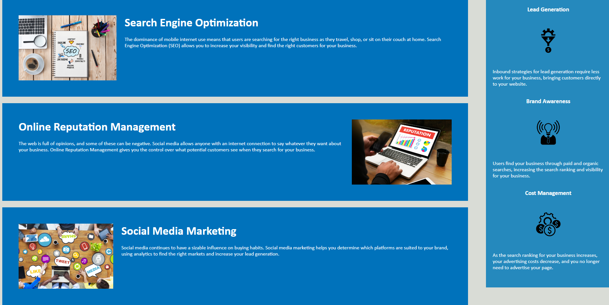

# Marketing-Refactor

## Description 

This is a marketing agency website optimized to follow accessibility standards for search engines. Horiseon talks about all the different ways people search things and promote or advertise their business. The marketing agency wanted to ensure that if any visitor encountered a problem like an image not loading it would not hinder their experience on the website. Trying to elude this problem by taking extra precautions is the expected when writing code. I read through both the html and css files via vs code and refactored to meet standards. I wanted to do this project to learn and test my ability when it comes to code refactoring. Doing so helped me find new ways to tag and style the page. I built this project to help an agency improve their range for online visitors. the button links now work, and the photos have tags incase the photos wont load. What makes my project stand out is its ability to still function without styles and positioning.

[Deployable-Link] (https://sufyaanvaidya.github.io/marketing-refactor/)

## Installation

1. i created a repository to store and update the files in github.
2. i created the repository i added the starter files to the repo.
3. When the starter files were added i begain to remove non-semantic elements and replace them with semantic elements.
4. After adding the semantic elements i gave all images an alt tags describing them, and corrected any missing links and id's.
5. When all the alt tags were added i when through the html file and put the headings in sequential order.
6. Once the headings were in order all the html had left was a new and fitting title in which i added.
7. After completing the html file i began editing the css file elements to match the semantic elements on the html.
8. Once all the elements matched i began to comment on the css file above each line of code i modified.
9. Finally, i added an MIT license to my repository.

## Usage 

- Clicking "Search Engine Optimization" will direct you lower in the page to the Search Engine Optimization summary.

- Clicking "Online Reputation Management" will direct you further down on the page to the Online Reputation Management summary.

- Clicking "Social Media Marketing" will direct you to the bottom of the page to the Social Media Marketing summary

## Credits

- Sufyaan Vaidya (https://github.com/SufyaanVaidya)
- (https://www.w3schools.com/)

## License

- This website has an MIT license 
- (https://github.com/SufyaanVaidya/marketing-refactor/blob/54dbbea18742985041c771dd9f11aa564f63fa6c/license.md)